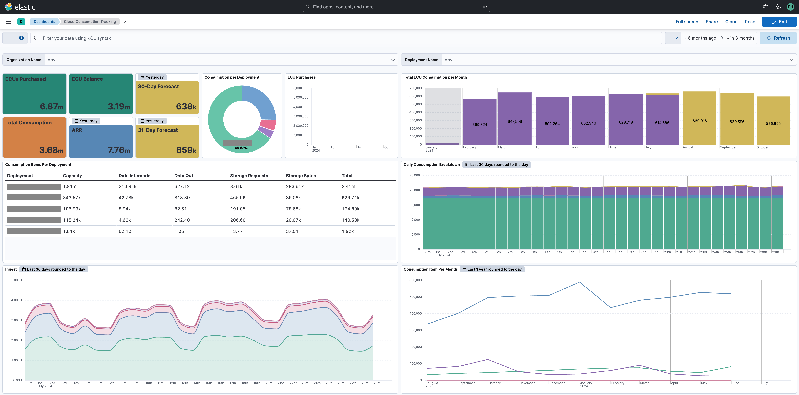

# Elastic Cloud Tracking

### A project to aid in tracking and forecasting Elastic Cloud consumption data.
This repo includes:
- A Python script to pull Elastic Cloud consumption data via Elastic Cloud APIs and ingest the data into an Elasticsearch index for analysis
- An example Kibana dashboard (shown below) to kickstart analysis


### Quickstart - Docker (Recommended)
0. Prereqs:
    - Install Docker
    - Retrieve your API keys for the Elastic Cloud Billing APIs. They will need the billing admin privileges.
    - An Elastic Cloud deployment for the results. You'll need the connection and auth details for it. 

1. Clone this repo & change directories into the repo folder

2. Build the Docker container:
```
docker build --no-cache -t elastic-cloud-tracking:latest .
```

3. Make a copy of `config.yml`, rename it to something memorable, e.g. `config-pathoge.yml`, and input your configuration/settings.

4. Run the container and mount your `config.yml` to the container to /app/config.yml at runtime e.g.:
```
docker run --rm -v ./config-pathoge.yml:/app/config.yml --name elastic-cloud-tracking elastic-cloud-tracking:latest
```
NOTE: On Windows you may have to run a slightly modified command:
```
docker run --rm -v //$(PWD)/config-pathoge.yml:/app/config.yml --name elastic-cloud-tracking elastic-cloud-tracking:latest
```

5. Import the dashboard/data view `export.ndjson` into your Kibana by going to:

-> Saved Objects -> Import -> Select file

6. Set your Kibana to use UTC time. This is required for the visualizations to work. 

-> Advanced Settings -> Time zone -> UTC